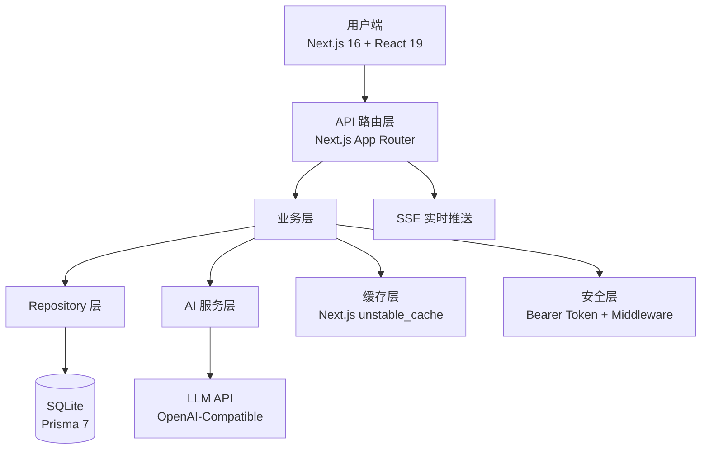

# 鹅苗雷达 🪿🎯

> AI 驱动的实习生适岗识别与成长干预系统

[](https://nextjs.org/)
[](https://react.dev/)
[](https://prisma.io/)
[](https://www.typescriptlang.org/)

---

## 📖 项目简介

**鹅苗雷达**是一款面向企业 HR 和导师团队的 AI 实习生管理平台，通过多维度数据采集（周报、导师反馈、任务完成率、能力评分），结合大语言模型进行智能分析，实现：

- **风险早发现** — 自动识别高风险实习生并生成预警
- **人才快识别** — 发现高潜人才并推荐培养路径
- **干预有方案** — AI 自动生成个性化干预方案和沟通话术
- **决策有数据** — 实时数据看板 + 周度分析报告 + AI 对话助手

---

## 🚀 核心功能

| 功能模块 | 说明 |
|---------|------|
| 📊 **雷达总览** | 实时数据仪表盘，风险分布、岗位统计、AI 今日提醒 |
| 👥 **实习生列表** | 多维度筛选、排序，支持分页查询 |
| 📋 **实习生画像** | 个人能力雷达图、历史趋势图、**AI 趋势预测**（虚线） |
| ⚠️ **风险预警** | 自动/手动标记，支持实时 SSE 推送通知 |
| 💡 **AI 建议** | LLM 生成个性化干预方案和导师沟通话术 |
| 🏆 **高潜人才** | 潜力识别、类型分类、成长路径推荐 |
| 🤖 **AI 助手** | 对话式查询，支持流式输出，**离线演示模式**可用 |
| 📄 **报告中心** | 一键生成周度分析报告，支持导出 PDF |
| 🎬 **评审演示** | 内置评审演示模式，自动播放完整工作流 |

---

## 🏗️ 技术架构



### 技术栈

- **前端**：Next.js 16.2 + React 19 + TypeScript + Ant Design 6 + Tailwind CSS v4
- **可视化**：ECharts + react-markdown
- **后端**：Next.js API Routes + Prisma 7 + SQLite (WAL 模式)
- **AI**：OpenAI-Compatible API（支持 SSE 流式输出）
- **缓存**：Next.js `unstable_cache` + `revalidateTag`
- **安全**：Bearer Token 认证 + CORS + CSP
- **部署**：Docker 多阶段构建 + Standalone 输出

---

## 📁 项目结构

```
goose-radar/
├── prisma/                  # 数据库 schema + seed
│   ├── schema.prisma
│   └── seed.ts
├── src/
│   ├── app/                 # Next.js App Router
│   │   ├── api/             # API 路由
│   │   │   ├── alerts/      # 风险预警 CRUD + SSE 流
│   │   │   ├── assistant/   # AI 助手对话（SSE 流式）
│   │   │   ├── dashboard/   # 仪表盘聚合数据
│   │   │   ├── interns/     # 实习生列表/详情/预测
│   │   │   ├── interventions/# 干预方案生成
│   │   │   ├── reports/     # 周度报告数据
│   │   │   └── suggestions/ # AI 建议生成
│   │   ├── (pages)/         # 页面路由
│   │   └── layout.tsx       # 根布局
│   ├── components/          # 公共组件
│   ├── lib/                 # 工具库
│   │   ├── ai.ts            # LLM 调用 + 流式 + Fallback
│   │   ├── assistant-tools.ts # AI 工具系统（查数据库）
│   │   ├── cache.ts         # 缓存封装
│   │   ├── prisma.ts        # Prisma Client 单例
│   │   ├── safe-json.ts     # 安全 JSON 处理
│   │   └── sanitize.ts      # XSS 防护
│   ├── repositories/        # 数据访问层
│   ├── middleware.ts        # 认证中间件
│   └── env.ts               # 环境变量校验
├── .github/workflows/ci.yml # CI/CD
├── Dockerfile               # 生产构建
└── docker-compose.yml       # 一键启动
```

---

## 🛠️ 快速开始

### 环境要求

- Node.js 20+
- npm 10+

### 1. 安装依赖

```bash
npm install
```

### 2. 配置环境变量

```bash
cp .env.example .env.local
```

编辑 `.env.local`：

```env
# 数据库（SQLite WAL 模式）
DATABASE_URL="file:./dev.db?journal_mode=WAL&busy_timeout=5000"

# API 认证（生产环境必须设置）
API_SECRET="your-random-secret-key"
# 开发环境跳过认证
SKIP_API_AUTH=true

# AI 服务（OpenAI-Compatible）
AI_BASE_URL=https://api.openai.com/v1
AI_API_KEY=sk-xxx
AI_MODEL=gpt-4o-mini

# 可选：演示模式（无 AI key 也能运行）
DEMO_MODE=true
```

### 3. 初始化数据库

```bash
npx prisma db push
npx prisma db seed
```

### 4. 启动开发服务器

```bash
npm run dev
```

访问 http://localhost:3000

---

## 🐳 Docker 部署

```bash
# 构建并启动
docker-compose up -d

# 查看日志
docker-compose logs -f app
```

---

## 🎭 演示模式

**无需 AI API Key 即可完整演示！**

系统会自动检测 AI 服务可用性：
- ✅ **有 Key** → 实时 LLM 对话 + 动态分析
- ❌ **无 Key** → 自动切换为**离线演示模式**
  - AI 助手：基于真实数据库查询 + 模板回答，流式打字效果
  - 报告中心：基于数据模板生成 AI 洞察摘要
  - 所有数据均为真实数据库查询结果

---

## 📸 功能截图

| 雷达总览 | AI 助手 | 报告导出 |
|---------|---------|---------|
| 数据仪表盘 + ECharts 图表 | 流式对话 + 数据库查询 | 周度报告 + PDF 导出 |

---

## 🔒 安全特性

- Bearer Token API 认证（生产环境强制）
- CORS 跨域限制
- Content-Security-Policy 响应头
- XSS 输入过滤
- SQL 注入防护（Prisma ORM）

---

## 🧪 测试

```bash
# 单元测试
npm run test

# E2E 测试
npm run test:e2e

# 类型检查
npm run type-check

# 代码格式化
npm run format
```

---

## 📄 License

MIT
